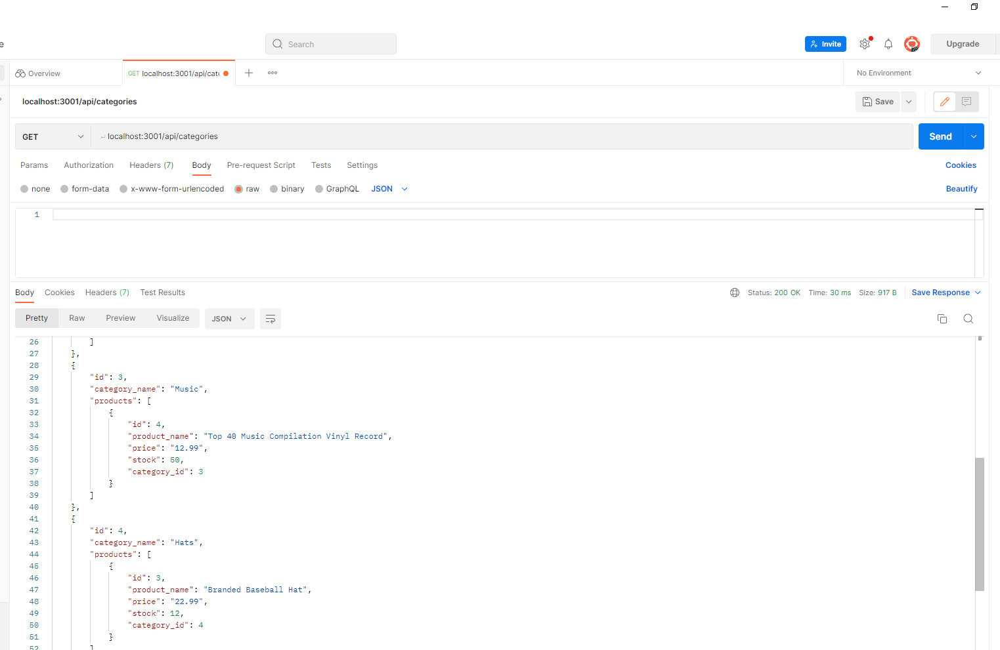

  # E-Commerce Back End

  

  ## Table of Contents:

  * [Description](#Description)

  * [Installation](#Installation)

  * [Usage](#Usage)

  * [Contributions](#Contributions)

  * [Test](#Tests)

  * [Email](#Questions)

  * [Github](#Questions)

  ## Description: 
  This project uses MYSQL to make a database, sequelize to connect it to a JavaScript application and Postman to display how the various API routes work

  ## Installation: 
  This project requires node, sequelize and express packages
  
  ## Usage: 
  Here is a video link demonstrating how the application works: https://drive.google.com/file/d/1bHu2MkSRjjv_RTpA91-UzLyFIXHwi_Ci/view

  ## License:
  none 
  

  ## Contributions: 
  No contributions necessary

  ## Tests: 
  Can run the script npm run watch

  ## Questions:

  [Email](mailto:gabeab34@gmail.com)

  [GitHub](https://github.com/gabeab34)

